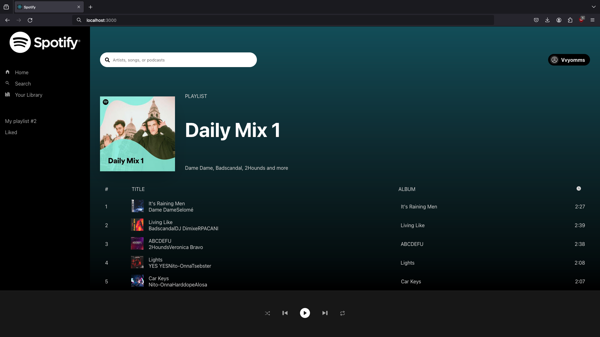

# Spotify Clone

This is a ReactJS clone of the popular music streaming website - Spotify. You will need a Premium account to play any music through the app.

<p align="center">
  
</p>

## Libraries and Tools Used

1. ReactJS
2. React Context API
3. Spotify API
4. styled-components
5. React Icons


## Quickstart

```shell
git clone https://github.com/VvyomShah/spotify-clone.git
cd spotify-clone
npm install
npm start
```
___

## Resources

1. https://react.dev/reference/react
2. https://developer.spotify.com/documentation/web-api
3. https://styled-components.com/docs
4. https://github.com/koolkishan/react-spotify-clone
5. https://github.com/francoborrelli/spotify-react-web-client
6. https://github.com/ErenYalcn/spotify-react-clone
